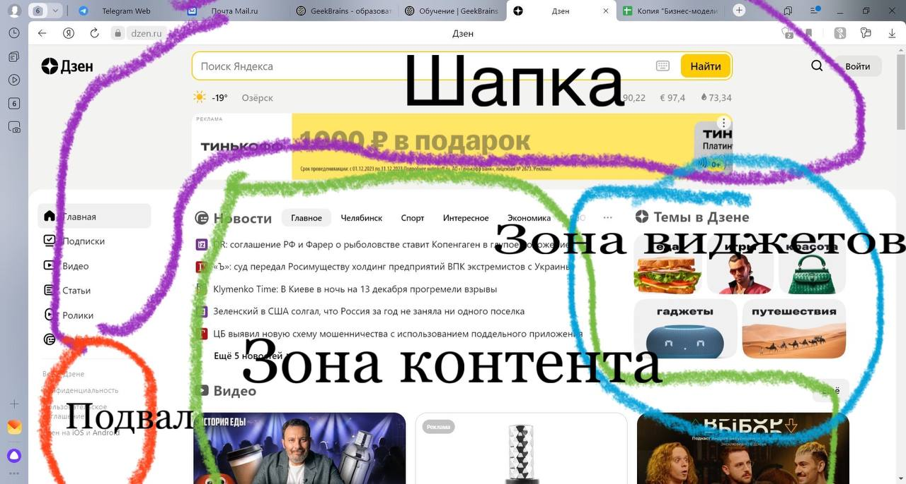
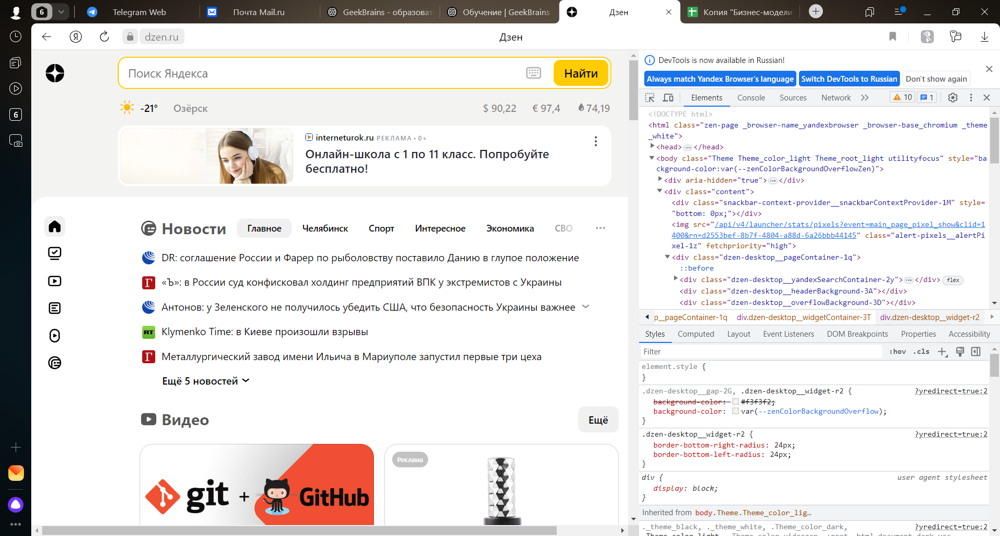
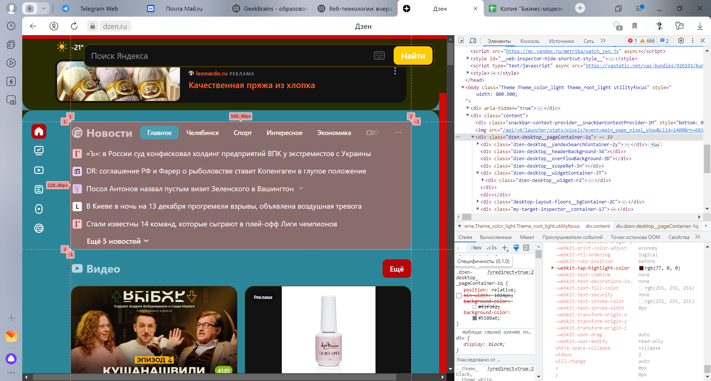

**Задача:**

на основе сайта yandex.ru:
1. Определите, на каком протоколе работает сайт.
2. Проанализируйте структуру страницы сайта.
3. Внесите не менее 10 изменений на страницу с помощью инструмента разработчика и представьте скриншоты было/стало.

**Решение:**

1. Сайт работает на протоколе https - защищенный протокол, для передачи данных (шифрует данные).

2. 

3. До:

После: 

Были изменены цвета, отступы, перемещены виджеты.